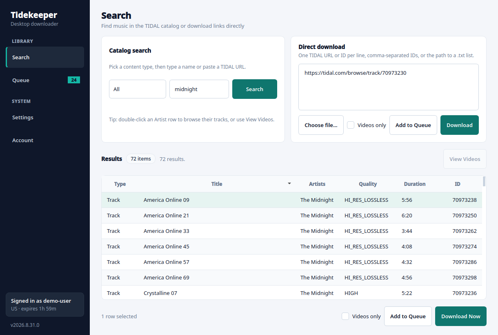
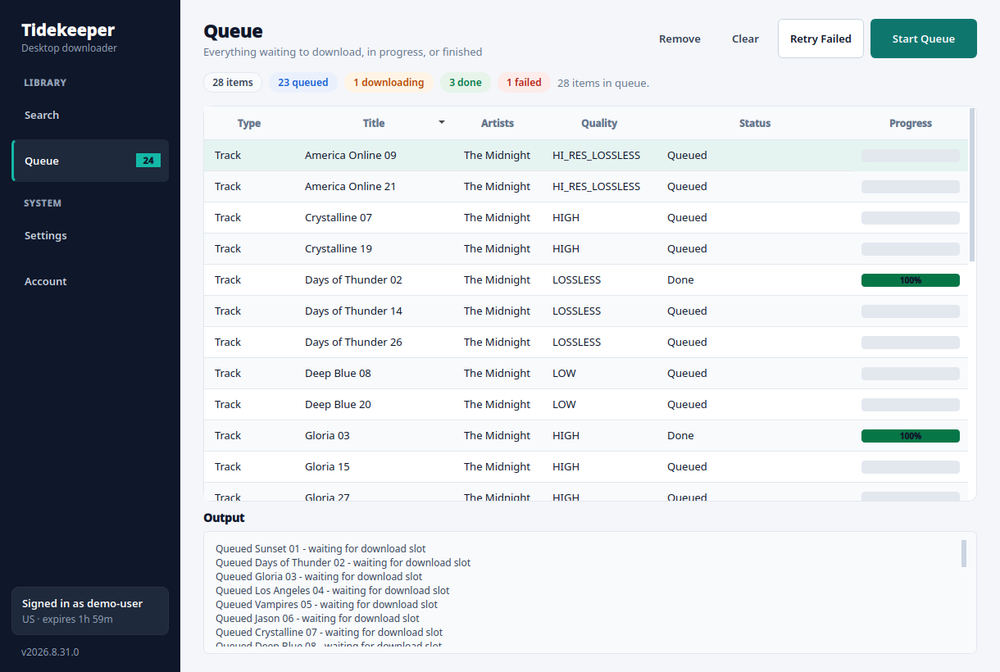
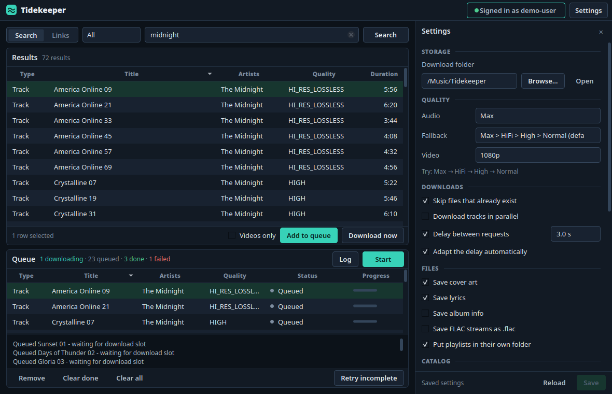
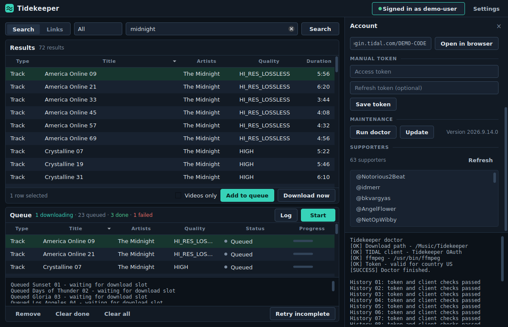

# Tidekeeper

Tidekeeper is an unofficial maintained fork of
[yaronzz/Tidal-Media-Downloader](https://github.com/yaronzz/Tidal-Media-Downloader),
with a reliable terminal workflow and optional desktop GUI. The primary command
is `tidekeeper`; `tidal-dl` remains available for compatibility.

[](https://github.com/OpenNerdz/tidekeeper/actions/workflows/ci.yml)
[](https://github.com/OpenNerdz/tidekeeper/actions/workflows/build.yml)
[](LICENSE)

## Install

Tidekeeper requires Python 3.10 or newer.

```bash
python -m pip install "git+https://github.com/OpenNerdz/tidekeeper.git#subdirectory=TIDALDL-PY"
tidekeeper
```

Linux and Termux users can use the installer:

```bash
curl -fsSL https://raw.githubusercontent.com/OpenNerdz/tidekeeper/main/install.sh | bash
```

For Android shared storage, run `termux-setup-storage` and optionally set:

```bash
export TIDEKEEPER_DOWNLOAD_PATH="/storage/emulated/0/Download/Tidekeeper"
```

## Usage

```bash
tidekeeper --help
tidekeeper --doctor
tidekeeper --paths
tidekeeper --open-output
tidekeeper --update
tidekeeper -l "https://tidal.com/browse/track/70973230"
tidekeeper --video-only -l "https://tidal.com/browse/artist/123456"
```

Dolby Atmos downloads are opt-in with `tidekeeper -q Atmos`.

Failed downloads are saved to `failed-tracks.txt` in the download folder and can
be retried with:

```bash
tidekeeper -l "/path/to/downloads/failed-tracks.txt"
```

## Customizability
Custom filename formats are supported:
| Tokens  | Description  | Album | Track | Video | Playlist |
| ------------- | ------------- | ------------- | ------------- | ------------- | ------------- |
| {ArtistID}  | Comma separated list of each artists' ID for that media (i.e: ```123, 456```)  | :white_check_mark:  | :x:  | :x:  | :x: |
| {ArtistName}  | Comma separated list of each artists' name for that media (i.e: ```ABC, DEF```)  | :white_check_mark:  | :x:  | :x:  | :x: |
| {ArtistName}  | Primary artist's name for that media | :x:  | :white_check_mark:  | :white_check_mark:  | :x: |
| {ArtistsName}  | Comma separated list of each artists' name for that media (i.e: ```ABC, DEF```)  | :x:  | :white_check_mark:  | :white_check_mark:  | :x: |
| {AlbumArtistID}  | Primary artist's ID for that media | :white_check_mark:  | :x:  | :x:  | :x: |
| {AlbumArtistName}  | Primary artist's name for that media | :white_check_mark:  | :x:  | :x:  | :x: |
| {Flag}  | Quality/content flags: `M` (Master), `A` (Dolby Atmos), `E` (Explicit) | :white_check_mark:  | :x:  | :x:  | :x: |
| {AlbumID}  |  | :white_check_mark:  | :x:  | :x:  | :x: |
| {AlbumYear}  |  | :white_check_mark:  | :white_check_mark:  | :x:  | :x: |
| {AlbumTitle}  |  | :white_check_mark:  | :white_check_mark:  | :x:  | :x: |
| {AudioQuality}  | Audio quality reported by TIDAL (e.g. `LOSSLESS`, `HI_RES`) | :white_check_mark:  | :white_check_mark:  | :x:  | :x: |
| {DurationSeconds}  |  | :white_check_mark:  | :white_check_mark:  | :x:  | :x: |
| {Duration}  | Duration formatted as `MM:SS` (or `H:MM:SS`) | :white_check_mark:  | :white_check_mark:  | :x:  | :x: |
| {NumberOfTracks}  |  | :white_check_mark:  | :x:  | :x:  | :x: |
| {NumberOfVideos}  |  | :white_check_mark:  | :x:  | :x:  | :x: |
| {NumberOfVolumes}  |  | :white_check_mark:  | :x:  | :x:  | :x: |
| {ReleaseDate}  |  | :white_check_mark:  | :x:  | :x:  | :x: |
| {RecordType}  |  | :white_check_mark:  | :x:  | :x:  | :x: |
| {TrackID}  |  | :x:  | :white_check_mark:  | :x:  | :x: |
| {TrackNumber}  |  | :x:  | :white_check_mark:  | :x:  | :x: |
| {TrackTitle}  |  | :x:  | :white_check_mark:  | :x:  | :x: |
| {ExplicitFlag}  |  | :x:  | :white_check_mark:  | :white_check_mark:  | :x: |
| {StreamQuality}  |  | :x:  | :white_check_mark:  | :x:  | :x: |
| {Codec}  |  | :x:  | :white_check_mark:  | :x:  | :x: |
| {VideoID}  |  | :x:  | :x:  | :white_check_mark:  | :x: |
| {VideoNumber}  |  | :x:  | :x:  | :white_check_mark:  | :x: |
| {VideoTitle}  |  | :x:  | :x:  | :white_check_mark:  | :x: |
| {VideoYear}  |  | :x:  | :x:  | :white_check_mark:  | :x: |
| {PlaylistUUID}  |  | :x:  | :x:  | :x:  | :white_check_mark: |
| {PlaylistName}  |  | :x:  | :x:  | :x:  | :white_check_mark: |

## Desktop GUI

```bash
python -m pip install "tidekeeper[gui] @ git+https://github.com/OpenNerdz/tidekeeper.git#subdirectory=TIDALDL-PY"
tidekeeper-gui
```

The GUI provides login, search, queueing, downloads, settings, diagnostics, and
updates. It is also available through `tidekeeper --gui`; update GUI installs
with `tidekeeper --update-gui`.

| Search | Queue |
| --- | --- |
|  |  |

| Settings | Account |
| --- | --- |
|  |  |

## Troubleshooting

For repeated HTTP 429 errors, keep **Use request delay** enabled and raise
**Request delay seconds** to `30` or `60` before retrying.

If Termux reports `cannot locate symbol "x265_api_get_216"`, refresh its media
packages with `pkg upgrade -y && pkg reinstall -y ffmpeg x265`. If that fails,
change mirrors with `termux-change-repo` and retry.

## Development

See [CONTRIBUTING.md](CONTRIBUTING.md) for setup and checks,
[CHANGELOG.md](CHANGELOG.md) for release history, and
[SECURITY.md](SECURITY.md) for private vulnerability reporting.

```bash
git clone https://github.com/OpenNerdz/tidekeeper.git
cd tidekeeper/TIDALDL-PY
python -m pip install -e .
python -m unittest discover -s tests
```

Build release artifacts with `./build.sh` from the repository root.

## Project policy

Tidekeeper does not aim to bypass access controls, subscription checks, or DRM.
Use it only where permitted by law and applicable service terms. This project is
not affiliated with or endorsed by TIDAL or Block, Inc.

The original project was created by YaronH and contributors. See
[NOTICE](NOTICE) and [LICENSE](LICENSE) for attribution and licensing.
