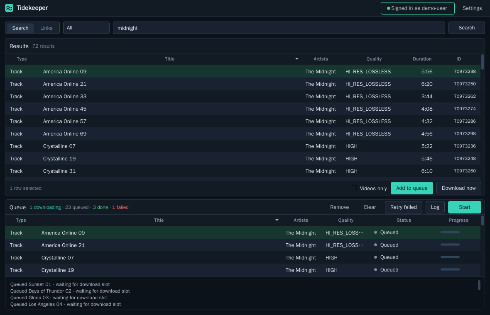

# Tidekeeper

Tidekeeper is an unofficial TIDAL downloader with a terminal interface and an
optional desktop app. It is a maintained fork of
[Tidal-Media-Downloader](https://github.com/yaronzz/Tidal-Media-Downloader).

[](https://github.com/OpenNerdz/tidekeeper/actions/workflows/ci.yml)
[](https://github.com/OpenNerdz/tidekeeper/actions/workflows/build.yml)
[](https://pypi.org/project/tidekeeper/)
[](https://github.com/OpenNerdz/tidekeeper/releases/latest)
[](LICENSE)
[](https://www.python.org/downloads/)

## Get started

### 1. Install Tidekeeper

Choose the option that best fits how you want to use it.

#### Python install

This is the recommended option if you already have Python 3.10 or newer. For
the terminal version:

```bash
python -m pip install -U tidekeeper
tidekeeper
```

For the desktop app:

```bash
python -m pip install -U "tidekeeper[gui]"
tidekeeper-gui
```

#### Standalone app

If you do not want to install Python, download the terminal or desktop app for
your operating system from the [latest GitHub Release](https://github.com/OpenNerdz/tidekeeper/releases/latest).
Builds are available for Windows, macOS, Linux x86-64, and Linux ARM64.

Standalone apps cannot replace themselves during an update. Download a newer
file from the Releases page when a new version is available.

#### Linux and Termux installer

```bash
curl -fsSL https://raw.githubusercontent.com/OpenNerdz/tidekeeper/main/install.sh | bash
```

On Android, first allow Termux to use shared storage:

```bash
termux-setup-storage
```

#### Docker

The Docker image includes ffmpeg and stores configuration and downloads in
folders on the host:

```bash
docker build -t tidekeeper .
docker run --rm -it \
  -v "$PWD/config:/config" \
  -v "$PWD/downloads:/downloads" \
  tidekeeper
```

The container runs as user ID `1000`, so both folders must be writable by that
user. The desktop app is not included in the Docker image.

### 2. Sign in

You only need to complete device login the first time and whenever Tidekeeper
needs a fresh session.

In the terminal:

1. Run `tidekeeper`.
2. Open the displayed `link.tidal.com` address.
3. Enter the displayed code and approve the login.
4. Return to Tidekeeper after the login succeeds.

In the desktop app:

1. Click **Signed out** to open the Account panel.
2. Click **Start device login**.
3. Click **Open in browser** and approve the login.

Tidekeeper may ask you to sign in once after an update changes the TIDAL
client. This is expected and prevents an old session from breaking downloads.

### 3. Download something

In the terminal, paste a TIDAL link at the prompt. You can also start a download
directly:

```bash
tidekeeper -l "https://tidal.com/browse/track/70973230"
```

In the desktop app, paste a link at the top and click **Download now**. You can
also search, select a result, and add it to the queue.

Use `tidekeeper --open-output` to open the download folder. Use only content
that your account can play and that you are permitted to download.

## Keep Tidekeeper updated

For a Python terminal install:

```bash
tidekeeper --update
```

For a Python desktop install, use the **Update** button in the Account panel or:

```bash
tidekeeper --update-gui
```

Restart Tidekeeper after updating. If you use a standalone app, download the
new executable from the [Releases page](https://github.com/OpenNerdz/tidekeeper/releases/latest)
instead. Check the installed version with `tidekeeper --version`.

## Common tasks

### Choose quality

`Max` is the default and requests the best available standard audio quality.
Dolby Atmos is optional because it is often a separate version of an album or
track. Select **Atmos** in the desktop app or use:

```bash
tidekeeper -q Atmos -l "TIDAL_LINK"
```

Tidekeeper will use a matching Atmos release when one is available. To download
only videos from a link, use:

```bash
tidekeeper --video-only -l "TIDAL_LINK"
```

### Change the download folder

Choose a folder in the desktop Settings panel, or pass one for a terminal
download:

```bash
tidekeeper --output "/path/to/music" -l "TIDAL_LINK"
```

To set the default folder before Tidekeeper creates its profile:

```bash
export TIDEKEEPER_DOWNLOAD_PATH="/path/to/music"
```

An existing profile keeps the folder already saved in its settings.

### Download a list

Pass a text file instead of a link:

```bash
tidekeeper -l "/path/to/links.txt"
```

The file can contain TIDAL links or IDs separated by lines, spaces, or commas.
Lines beginning with `#` are comments. A list can also point to another text
file. Repeated items are skipped.

If some items fail, Tidekeeper saves them to `failed-tracks.txt` in the download
folder. Retry that file with the same command.

### Customize names and folders

Filename templates use labels such as `{ArtistName}`, `{AlbumTitle}`, and
`{TrackTitle}`. The defaults work for most users. See the
[filename template guide](docs/filename-templates.md) for examples and the full
list of available labels.

## Desktop app

The desktop app keeps search, links, results, and the download queue in one
window. **Download now** starts immediately, while **Add to queue** lets you
prepare several downloads before clicking **Start**.

Completed items can be cleared without removing unfinished work. Failed,
partial, interrupted, and cancelled items can be retried. Select an item to see
its error details.

Settings affect the next download. Click **Save** if you want to keep them after
restarting. Changing the TIDAL client signs you out automatically, so sign in
again after saving that change.

Useful shortcuts:

- `Ctrl+F` focuses search.
- `Enter` adds a selected result to the queue.
- `Delete` removes selected queue items.
- `Ctrl+Z` restores the last removed queue item.
- `Ctrl+,` opens Settings.
- `Esc` closes the side panel.



| Settings | Account |
| --- | --- |
|  |  |

## Troubleshooting

Start by checking your installation, login, download folder, and local tools:

```bash
tidekeeper --doctor
tidekeeper --paths
```

### Login succeeds but a download fails with HTTP 404

Update Tidekeeper, close it completely, reopen it, and sign in again. Current
versions automatically remove sessions created by an old TIDAL client. If you
use a standalone app, make sure you downloaded the latest executable rather
than only pressing its Update button.

### Repeated HTTP 429 errors

TIDAL is temporarily limiting requests. Keep **Use request delay** enabled and
raise **Request delay seconds** to `30` or `60` before retrying.

### ffmpeg is missing

Install ffmpeg with your operating system's package manager. It is recommended
for video downloads and optional FLAC remuxing. The Docker image already
includes it.

### Termux reports `cannot locate symbol "x265_api_get_216"`

Refresh the media packages:

```bash
pkg upgrade -y
pkg reinstall -y ffmpeg x265
```

If that does not work, run `termux-change-repo`, choose another mirror, and try
again.

### Still need help?

Open a [GitHub issue](https://github.com/OpenNerdz/tidekeeper/issues) and include:

- The version shown by `tidekeeper --version`.
- How you installed Tidekeeper.
- Your operating system.
- The complete error message with private tokens removed.

## Install the latest source

Use this only if you specifically want the newest code from GitHub:

```bash
python -m pip install -U "git+https://github.com/OpenNerdz/tidekeeper.git#subdirectory=TIDALDL-PY"
```

## Development

See [CONTRIBUTING.md](CONTRIBUTING.md) for setup and checks,
[CHANGELOG.md](CHANGELOG.md) for release history, and
[SECURITY.md](SECURITY.md) for private vulnerability reporting.

```bash
git clone https://github.com/OpenNerdz/tidekeeper.git
cd tidekeeper/TIDALDL-PY
python -m pip install -e .
python -m unittest discover -s tests
```

Build release artifacts with `./build.sh` from the repository root.

## Project policy

Tidekeeper does not aim to bypass access controls, subscription checks, or DRM.
Use it only where permitted by law and applicable service terms. This project is
not affiliated with or endorsed by TIDAL or Block, Inc.

The original project was created by YaronH and contributors. See
[NOTICE](NOTICE) and [LICENSE](LICENSE) for attribution and licensing.
