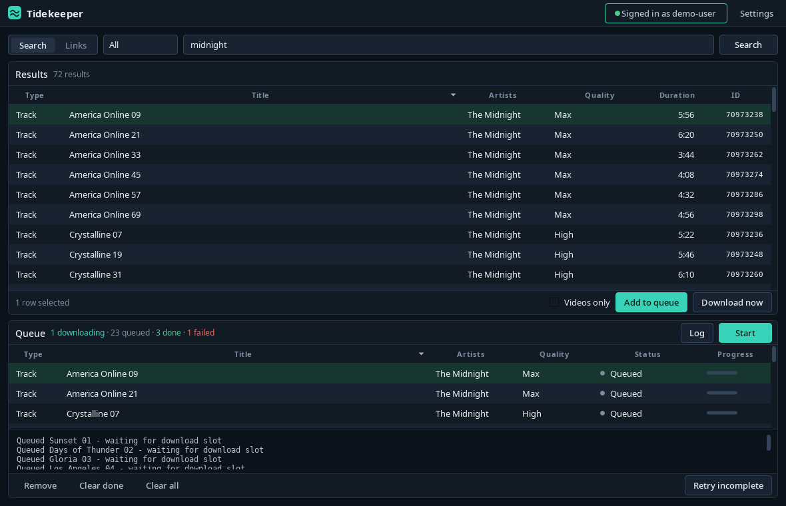
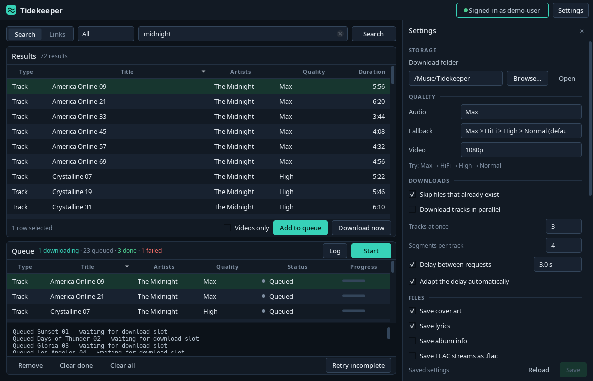
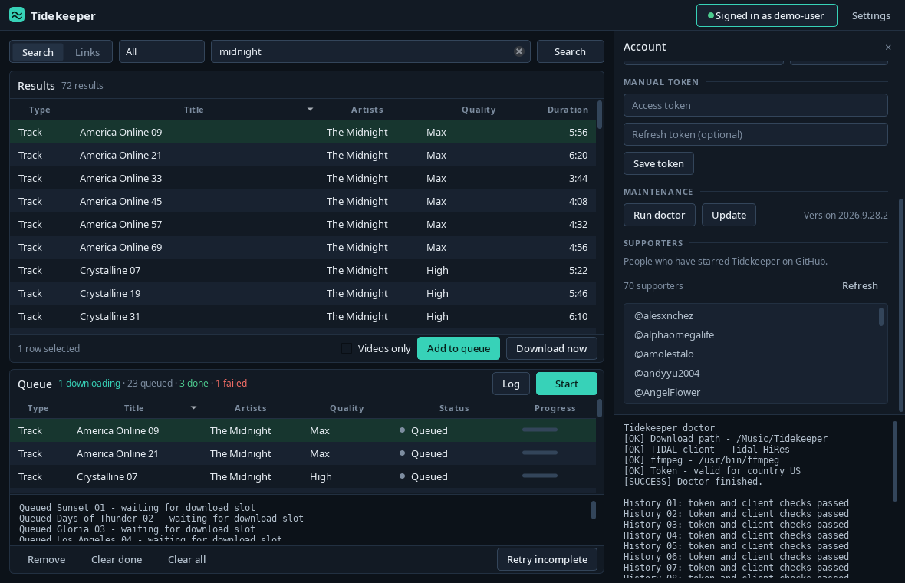

# Tidekeeper

Download the music and videos you can play on TIDAL, from lossless and hi-res
FLAC to Dolby Atmos, using a terminal or a desktop app. Tidekeeper is a
maintained fork of
[Tidal-Media-Downloader](https://github.com/yaronzz/Tidal-Media-Downloader).

[](https://github.com/OpenNerdz/tidekeeper/actions/workflows/build.yml)
[](https://pypi.org/project/tidekeeper/)
[](https://pypi.org/project/tidekeeper/)
[](LICENSE)

- **Best available quality.** FLAC up to 24-bit/192 kHz, with automatic fallback
  when a format is unavailable.
- **Anything with a link.** Tracks, albums, playlists, mixes, artists, videos, or
  a text file full of links.
- **Tagged and organized.** Metadata, cover art, and lyrics, in folders you name.
- **Picks up where it left off.** Interrupted downloads resume and finished
  files are skipped.
- **Runs everywhere.** Windows, macOS, Linux, Android (Termux), and Docker.



## Install

**With Python 3.10 or newer** (recommended):

```bash
python -m pip install -U "tidekeeper[gui]"   # desktop app and terminal
python -m pip install -U tidekeeper          # terminal only
```

**Without Python:** download the terminal or desktop app for Windows, macOS
(Apple silicon or Intel), or Linux (x86-64 or ARM64) from the
[latest release](https://github.com/OpenNerdz/tidekeeper/releases/latest).

**Linux or Android (Termux):** this script installs Tidekeeper and ffmpeg. On
Android, run `termux-setup-storage` first so downloads can reach shared storage.

```bash
curl -fsSL https://raw.githubusercontent.com/OpenNerdz/tidekeeper/main/install.sh | bash
```

**Docker:** the image includes ffmpeg. Settings and downloads stay in the
mounted folders, which must be writable by user ID `1000`.

```bash
docker build -t tidekeeper https://github.com/OpenNerdz/tidekeeper.git
docker run --rm -it -v "$PWD/config:/config" -v "$PWD/downloads:/downloads" tidekeeper
```

**Also install [ffmpeg](https://ffmpeg.org/download.html)**, for example with
`brew install ffmpeg`, `winget install ffmpeg`, or `sudo apt install ffmpeg`.
Videos need it, and it saves lossless audio as `.flac` instead of `.m4a`.

## Quick start

1. **Sign in.** Run `tidekeeper`, or open `tidekeeper-gui` and click
   **Signed out** → **Start device login**. Open the link it shows and approve
   the sign-in. The session is saved, so this is usually a one-time step.
2. **Download.** Paste a TIDAL link at the terminal prompt, or run:

   ```bash
   tidekeeper -l "https://tidal.com/browse/album/123456"
   ```

   In the desktop app, search for something or paste links in **Links**, then
   click **Download now**.

Downloads go to a `download` folder inside the directory you start Tidekeeper
from (`Download/Tidekeeper` on Android, `/downloads` in Docker). To choose a
permanent folder, use **Settings** or run `tidekeeper -o ~/Music` once. To set
the folder before Tidekeeper saves its first settings, for example in a script
or container, set the `TIDEKEEPER_DOWNLOAD_PATH` environment variable.

## Terminal

Run `tidekeeper` on its own for an interactive menu: paste a link, or pick a
number to sign in, change quality, choose a folder, or edit options. Or pass
options directly:

| Option | What it does |
| --- | --- |
| `-l, --link LINK` | Download a link, an ID, or a text file of links |
| `-o, --output FOLDER` | Set the download folder |
| `-q, --quality NAME` | Use one audio quality: `Max`, `HiFi`, `High`, `Normal`, or `Atmos` |
| `--quality-priority LIST` | Try qualities in order, for example `Max,HiFi,High` |
| `-r, --resolution NAME` | Set the highest video resolution: `1080`, `720`, `480`, `360`, or `240` |
| `--video-only` | Download only the videos from an artist, album, playlist, or mix |
| `--doctor` | Check your login, download folder, and ffmpeg |
| `--paths` | Show where settings, the login, and logs are stored |
| `--open-output` | Open the download folder |
| `--update` | Update Tidekeeper (`--update-gui` for the desktop app too) |
| `-c, --configPathOverride FOLDER` | Keep settings and the login in another folder |

`-o`, `-q`, `--quality-priority`, and `-r` are saved as your new defaults.

**Links** can be full URLs, links without `https://` (such as
`tidal.com/browse/track/123` or `listen.tidal.com/album/456`), or bare IDs.
**Text files** can hold links separated by lines, spaces, or commas. Lines
starting with `#` are comments, a file can include other files, and repeated
items are skipped. Tracks that fail are listed in `failed-tracks.txt` in the
download folder. Pass that file back to `-l` to retry them.

## Desktop app

Search the catalog or paste links, then build a queue. **Download now** starts
right away, and **Add to queue** lets you line up several downloads before you
click **Start**. You can drag links from a browser, or `.txt` files from your
file manager, onto the window.

Select a queue row to see why it failed. **Retry incomplete** downloads only the
items that did not finish. Settings apply to the next download; click **Save** to
keep them after a restart.

| Shortcut | Action |
| --- | --- |
| <kbd>Ctrl</kbd>+<kbd>F</kbd> | Search |
| <kbd>Enter</kbd> | Add selected results to the queue |
| <kbd>Delete</kbd> | Remove selected queue items |
| <kbd>Ctrl</kbd>+<kbd>Z</kbd> | Undo the last removal |
| <kbd>Ctrl</kbd>+<kbd>,</kbd> | Open Settings |
| <kbd>Esc</kbd> | Close the side panel |

| Settings | Account |
| --- | --- |
|  |  |

## Quality and files

| Quality | You get |
| --- | --- |
| **Max** (default) | FLAC up to 24-bit/192 kHz, when the track has it |
| **HiFi** | FLAC, 16-bit/44.1 kHz |
| **High** | AAC, 320 kbps |
| **Normal** | AAC, 96 kbps |
| **Atmos** | Dolby Atmos, when the release has an Atmos version |

New installs try **Max → HiFi → High → Normal**, so a track still downloads when
the best format is unavailable. `-q` picks one quality with no fallback, and
`--quality-priority` sets your own order. Videos download at the highest
resolution up to your setting. An old **Master** (MQA) setting now means lossless
FLAC, because TIDAL retired MQA in 2024.

By default, files are organized like this:

```text
download/
└── Artist/
    └── Album [123456] [2024]/
        ├── 01 - Artist - First Track.flac
        ├── 02 - Artist - Second Track.flac
        └── cover.jpg
```

Change the layout with [filename templates](docs/filename-templates.md). Other
options, such as `.lrc` lyrics files, parallel downloads, request delays, and
playlist folders, are in **Settings** or the terminal menu's **Options**.

## Update

```bash
tidekeeper --update       # terminal
tidekeeper --update-gui   # desktop app and terminal (or click Update in Account)
```

Standalone apps can't update themselves. Download the new version from the
[releases page](https://github.com/OpenNerdz/tidekeeper/releases/latest).

## Troubleshooting

Start with `tidekeeper --doctor`. It checks your login, download folder, and
ffmpeg, and tells you what to fix.

If another Tidekeeper process on the same computer is already writing the same
file, the download waits and tells you why. Lock files live in your private
app-state folder, not inside the music library, so downloads on shared or
network storage do not need to support file locking themselves.

<details>
<summary><b>I was signed out after updating or changing the TIDAL client</b></summary>

Sessions belong to the client that created them, so sign in again once. If you
use a standalone app, make sure you downloaded the latest release.

</details>

<details>
<summary><b>Max downloads are only 16-bit/44.1 kHz</b></summary>

Max is a ceiling. Tracks that TIDAL only offers in CD quality stay 16-bit. For
hi-res tracks, choose the **Tidal HiRes** client (desktop **Settings → Advanced**,
or terminal menu option **7**), save, and sign in again.

</details>

<details>
<summary><b>Playback fails with HTTP 404 / subStatus 4022</b></summary>

TIDAL rejected this client for that format, but your login is still valid.
Tidekeeper tries other endpoints and your fallback qualities automatically. Try
**HiFi** or `--quality-priority Max,HiFi,High,Normal`. If it keeps failing,
include the endpoint, client, country, and quality from the error in an issue.

</details>

<details>
<summary><b>Repeated HTTP 429 (too many requests)</b></summary>

TIDAL is limiting requests. Keep the request delay on and raise it to `30` or
`60` seconds in **Settings** (terminal menu **Options**), then retry.

</details>

<details>
<summary><b>Videos fail or audio is saved as .m4a</b></summary>

Install ffmpeg (see [Install](#install)) and run `tidekeeper --doctor` to confirm
Tidekeeper can find it.

</details>

<details>
<summary><b>macOS or Windows won't open the standalone app</b></summary>

The apps aren't code-signed. On macOS, run
`xattr -d com.apple.quarantine tidekeeper-gui` (or `tidekeeper`) in the folder
you extracted it to. On Windows, choose **More info → Run anyway**.

</details>

<details>
<summary><b>Termux: ffmpeg reports <code>cannot locate symbol</code></b></summary>

Update all packages together, then reinstall ffmpeg:

```bash
pkg upgrade -y && pkg reinstall -y ffmpeg
```

If that doesn't work, run `termux-change-repo`, pick another mirror, and repeat.

</details>

Still stuck? [Open an issue](https://github.com/OpenNerdz/tidekeeper/issues) with
the output of `tidekeeper --version`, how you installed Tidekeeper, your
operating system, and the full error message with any tokens removed.

## Contributing

Bug reports and pull requests are welcome. [CONTRIBUTING.md](CONTRIBUTING.md)
covers setup and checks, and [CHANGELOG.md](CHANGELOG.md) lists every release.
Report security issues privately as described in [SECURITY.md](SECURITY.md).

## License and policy

Tidekeeper is released under the [Apache 2.0 license](LICENSE). The original
project was created by YaronH and contributors; see [NOTICE](NOTICE).

Tidekeeper does not bypass access controls, subscription checks, or DRM.
Download only what your account can play, where the law and TIDAL's terms allow
it. This project is not affiliated with or endorsed by TIDAL or Block, Inc.
